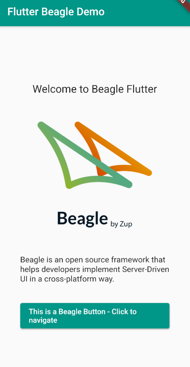

# Beagle Samples
This repository contains a set of individual projects to help you learn and test Beagle for Android, iOS, Web and Backend. Each sample demonstrates different use cases, complexity levels and more.

  

For more information, please [read the documentation](https://docs.usebeagle.io)

💻 Requirements
------------

To try out these sample apps, you can use your preferred IDE and follow the minimal requirements for each of the platforms.

[Android](https://docs.usebeagle.io/v1.10/android/getting-started/)
[iOS](https://docs.usebeagle.io/v1.10/ios/getting-started/)
[Flutter](https://docs.usebeagle.io/v1.10/flutter/overview/)
[Web](https://docs.usebeagle.io/v1.10/web/)
[Backend](https://docs.usebeagle.io/v1.10/backend/overview/)

:whale:	Running the backend with docker
------------

If you are only looking for testing the frontend projects and you have docker installed in your machine you can easily use docker compose to build our backend project without the need of any extra configuration.

TO DO: Explain how to run docker compose

🧬 Samples
------------

| Project | Preview|
|:-----|---------|
|  **Hello Beagle**.  A getting started project for you to try out Beagle into your preferred platform, This project contains the basic configuration for each platform and how to load Server Driven Screens into them  • Low complexity • Flutter  • Web • Android • iOS   **[> Browse](HelloBeagle/)**     | |
|  |  |
| **Login and Byometric Login**.  A Beagle implementation of a biometry login flow, using touch id or face id (for iOS). This example was created inspired on the ITI application, just to show what Beagle can do. It does not had any code from ITI itself. In this sample a custom action is created to manage the app's login flow. Also some custom widgets are created to display information on the screen. A **listView** is also implementend on this sample. You can check its code on the Backend project listed here   • Medium complexity • Custom Actions  • Custom Widgets • Navigation  **[> Browse](LoginBeagle/)**     |  |
|  |  |
|  **Positioning elements Screen**.  A screen created only to show how elements are positioned in a screen. Learn more about flex and position with Beagle's layout engine [Yoga Layout](https://yogalayout.com/).   • Low complexity • Flex  • Style   **[> Browse](FlexScreenBeagle/)**     | |
|  |  |
|  **Custom operation example Screen**.   A custom operation that validates a password using a regular expression (REGEX) and that notifies through a text that changes at the screen between values "Senha Inválida" for invalid values and "Senha válida" for valid values. The text is changed at the screen using context (a resource from Beagle).   • Low complexity • Custom Operations  • Context   **[> Browse](CustomOperationBeagle/)**     | | 
|  |  |
|  **Fallback Screen example**.   A Fallback screen that could be called when a screen request fails. This screen is called from the backend and most of its configuration are set on the backend, but a few details must be added into a front end design system.   • Low complexity • Fallback Screen example  • Design System   **[> Browse](FallbackScreen/)**     | |

🗂 Zup Open Source Forum
------------

