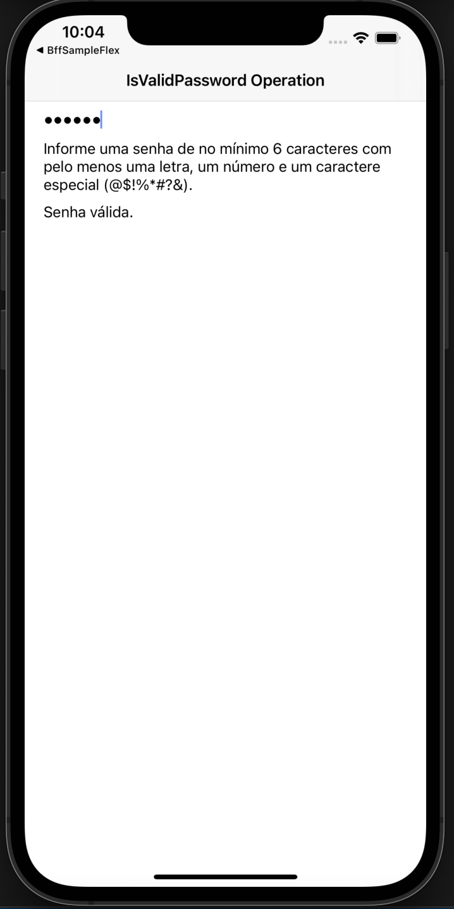

# Beagle Samples

This repository contains a set of individual Beagle projects to help you learn about
Beagle in Android, iOS, Web and Backend. Each sample demonstrates different use cases, complexity levels and more.

For more information, please [read the documentation](https://docs.usebeagle.io)

💻 Requirements
------------

To try out these sample apps, you need to use [Intellij IDEA](https://www.jetbrains.com/idea/).
You can clone this repository and test out each project in each folder.

🧬 Samples
------------

| Project | |
|:-----|---------|
| A hello world with Beagle that shows one of the most basic screens you can do. Just for the sake of doing a hello world as your first screen.    • Basic complexity    **[> Browse](HelloBeagle/)**   |  |
|  |  |
| A Beagle implementation of a biometry login flow, using touch id or face id. It's created a custom action to manage the login flow of the app. Also some custom widgets are created to display information on the screen.   • Medium complexity • Custom Actions  • Custom Widgets • Navigation  **[> Browse](LoginBeagle/)**     | |
|  |  |
| A screen created only for positioning matters. Learn more about flex and positioning with Beagle's layout engine [Yoga Layout](https://yogalayout.com/).   • Low complexity • Flex  • Style   **[> Browse](FlexScreenBeagle/)**     | |
|  |  |
| A custom operation that validates a password using a regular expression and notifies through a text changed by a context.   • Low complexity • Custom Operations  • Context   **[> Browse](CustomOperationBeagle/)**     | | 

🗂 Zup Open Source Forum
------------

