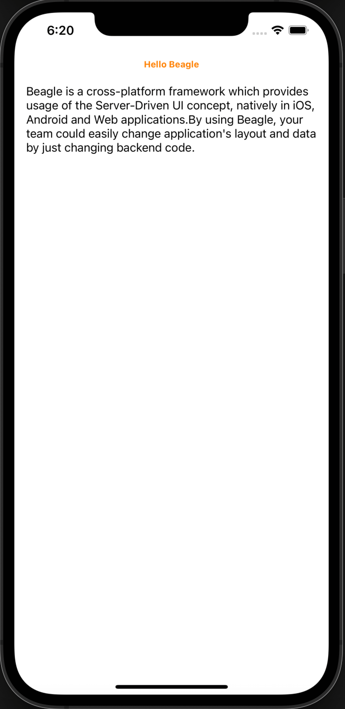

# Beagle Samples

This repository contains a set of individual Beagle projects to help you learn about
Beagle in Android, iOS, Web and Backend. Each sample demonstrates different use cases, complexity levels and more.

For more information, please [read the documentation](https://docs.usebeagle.io)

💻 Requirements
------------

To try out these sample apps, you need to use [Intellij IDEA](https://www.jetbrains.com/idea/).
You can clone this repository and test out each project in each folder.

🧬 Samples
------------

| Project | |
|:-----|---------|
| A Beagle implementation of a biometry login flow, using touch id or face id (for iOS). This example was created inspired on the ITI application, just to show what Beagle can do. It does not had any code from ITI itself. In this sample a custom action is created to manage the app's login flow. Also some custom widgets are created to display information on the screen. A **listView** is also implementend on this sample. You can check its code on the Backend project listed here   • Medium complexity • Custom Actions  • Custom Widgets • Navigation  **[> Browse](LoginBeagle/)**     |  |
|  |  |
| A hello world with Beagle that shows one simple basic screen. This is a good first screen to help you understand Beagle and the server driven ui concept.    • Basic complexity    **[> Browse](HelloBeagle/)**   | |
|  |  |
| A screen created only to show how elements are positioned in a screen. Learn more about flex and position with Beagle's layout engine [Yoga Layout](https://yogalayout.com/).   • Low complexity • Flex  • Style   **[> Browse](FlexScreenBeagle/)**     | |
|  |  |
| A custom operation that validates a password using a regular expression (REGEX) and that notifies through a text that changes at the screen between values "Senha Inválida" for invalid values and "Senha válida" for valid values. The text is changed at the screen using context (a resource from Beagle).   • Low complexity • Custom Operations  • Context   **[> Browse](CustomOperationBeagle/)**     | | 
|  |  |
| A Fallback screen that could be called when a screen request fails. This screen is called from the backend and most of its configuration are set on the backend, but a few details must be added into a front end design system.   • Low complexity • Fallback Screen example  • Design System   **[> Browse](Fallback/)**     | |

🗂 Zup Open Source Forum
------------

